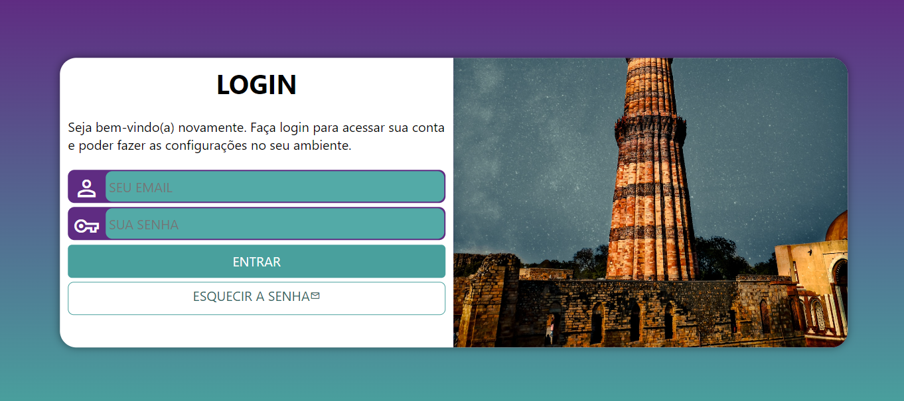

# TELA DE LOGIN
👨‍🏫PROJETO FEITO PARA O CURSO DE HTML E CSS DO CURSO EM VIDEO.

  

## DESCRIÇÃO:
O "TELA DE LOGIN" é uma aplicação que oferece uma interface de login para os usuários acessarem suas contas. O aplicativo fornece uma interface simples e intuitiva para os usuários acessarem suas contas de forma segura e eficiente. Ele oferece uma experiência de usuário agradável com um design responsivo que se adapta a diferentes tamanhos de tela. Aqui estão os principais recursos do aplicativo:

- **Formulário de Login:**
  - Os usuários podem inserir seu e-mail e senha nos campos fornecidos.
  - O formulário oferece campos de entrada para e-mail e senha, com ícones visuais representando cada campo.

- **Botão de Entrar:**
  - Ao clicar no botão "ENTRAR", os dados de login são enviados para a página de cadastro para autenticação.

- **Recuperação de Senha:**
  - Um link está disponível para os usuários recuperarem suas senhas caso tenham esquecido.

## EXECUTANDO O APLICATIVO:
1. Abra o arquivo `CODIGO.html` em um navegador da web.
2. Insira seu e-mail e senha nos campos fornecidos.
3. Clique no botão "ENTRAR" para fazer login.
4. Se necessário, clique no link "ESQUECIR A SENHA" para iniciar o processo de recuperação de senha.

## NÃO SABE?
- Entendemos que para manipular arquivos em `HTML`, `CSS` e outras linguagens relacionadas, é necessário possuir conhecimento nessas áreas. Para auxiliar nesse aprendizado, oferecemos cursos gratuitos disponíveis:
* [CURSO DE HTML E CSS](https://github.com/VILHALVA/CURSO-DE-HTML-E-CSS)
* [CURSO DE JAVASCRIPT](https://github.com/VILHALVA/CURSO-DE-JAVASCRIPT)
* [CONFIRA MAIS CURSOS](https://github.com/VILHALVA?tab=repositories&q=+topic:CURSO)

## CREDITOS:
- [PROJETO FEITO PELO VILHALVA](https://github.com/VILHALVA)
- [PROJETO FEITO PARA O CURSO DE HTML E CSS](https://github.com/VILHALVA/CURSO-DE-HTML-E-CSS)
